# Dr. Hassan Al Hawary Platform

A comprehensive mobile solution designed for Dr. Hassan Al Hawary's educational content, consisting of two dedicated Android applications: a **User App** for students/followers and an **Admin App** for content management.

---

## 📱 User Application (`:app`)

The User App provides a seamless and interactive experience for users to consume Dr. Hassan's educational materials.

### Key Features:
- **Authentication & Onboarding:** Secure user registration and personalized onboarding experience.
- **Home Dashboard:** Quick access to the latest articles, videos, and featured content.
- **Multimedia Learning:**
    - **Video & Audio Players:** High-quality playback for educational lectures.
    - **Image Galleries:** Visual learning aids and resources.
    - **Article Reader:** Clean UI for reading in-depth educational articles.
- **Study System:** A structured journey map for student progress.
- **Search:** Efficient searching across all content types.
- **Profile Management:** User personalization and settings.

### User App Screenshots:

| Splash & Onboarding | Authentication | Home & Content | Study & Profile |
|:---:|:---:|:---:|:---:|
| 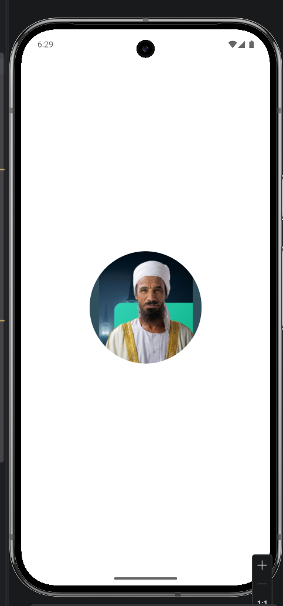 | 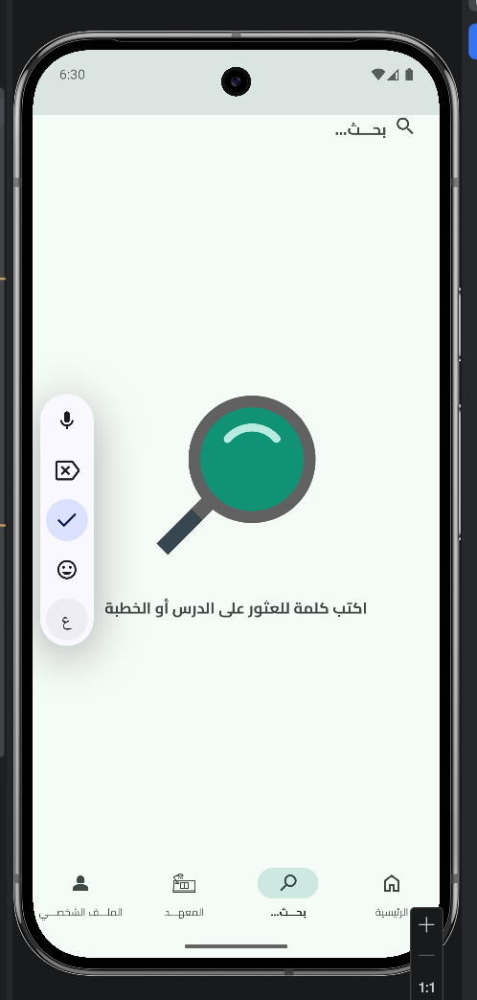 | 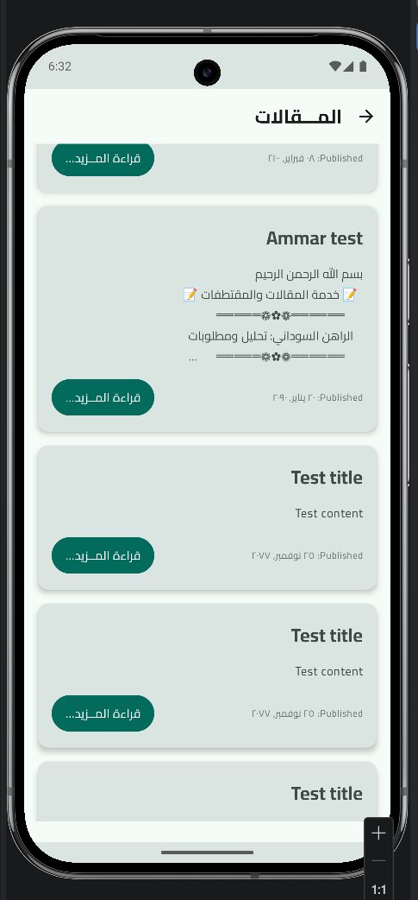 | 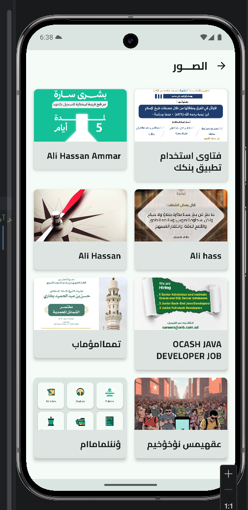 |
|  | 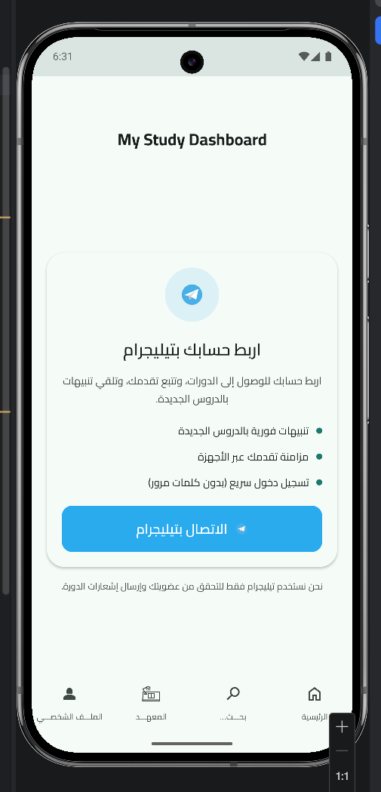 | 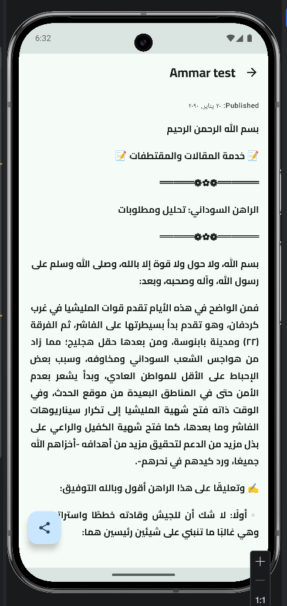 | 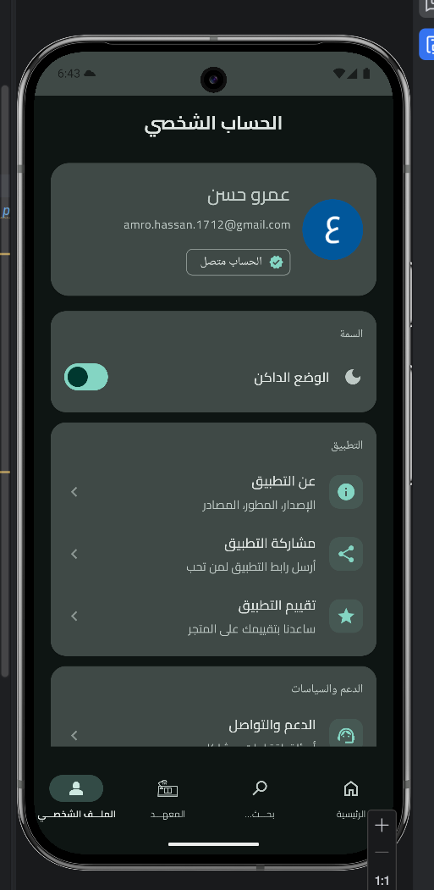 |
| 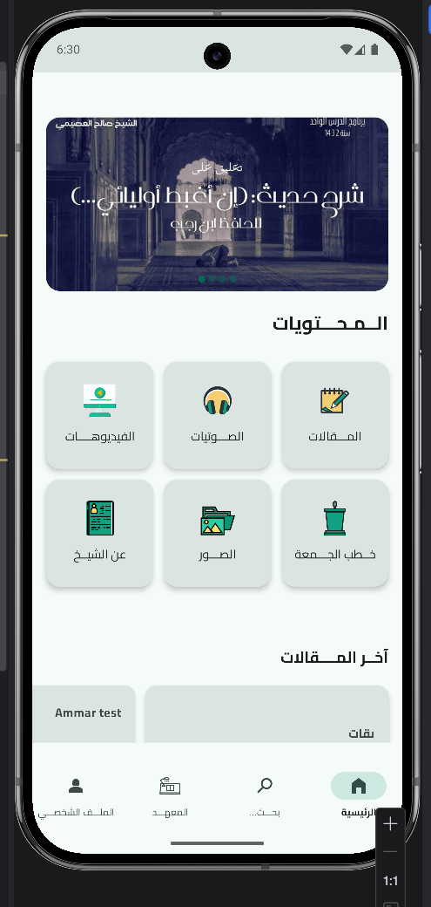 | 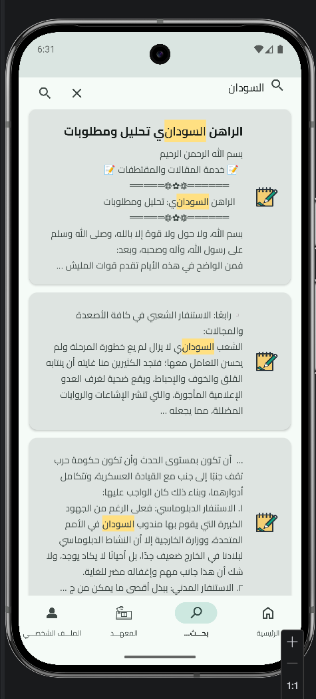 | 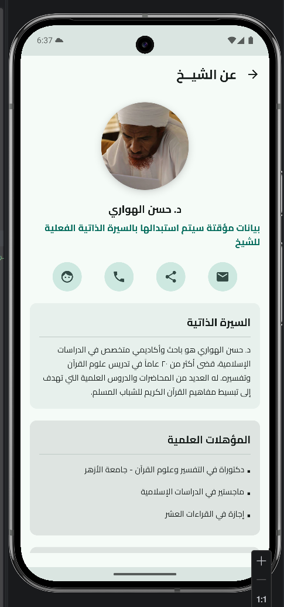 | 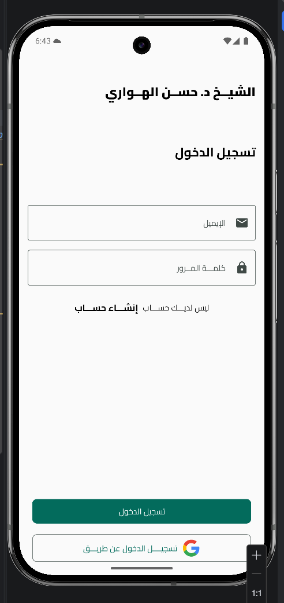 |

#### Additional Screens:

  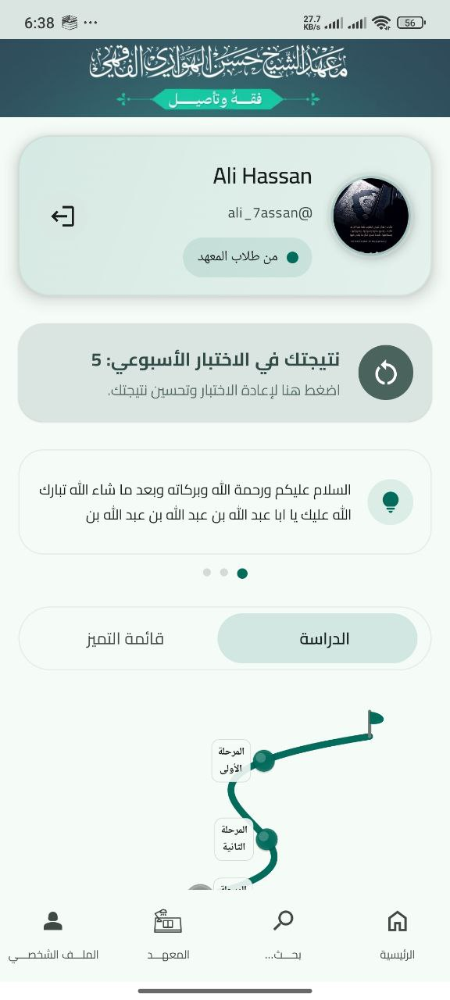
  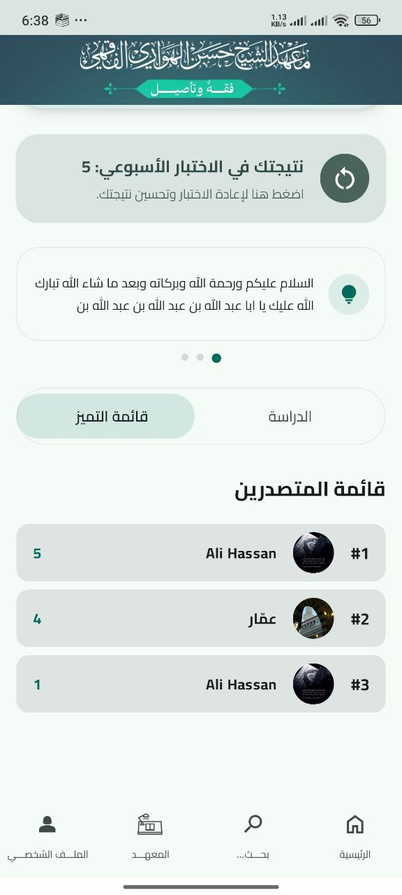
  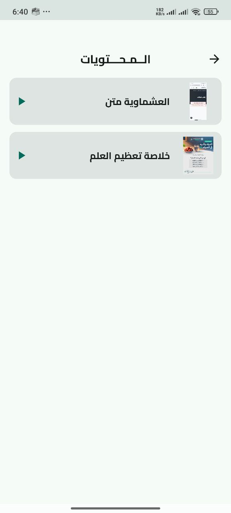
  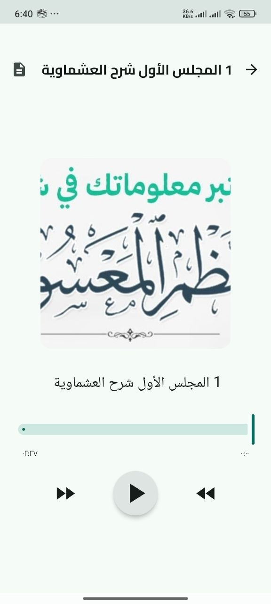

---

## 🛠️ Admin Application (`:admin`)

The Admin App empowers Dr. Hassan and his team to manage the platform's content dynamically.

### Key Features:
- **Content Management (CMS):** Upload, edit, and delete articles, videos, audio, and images.
- **User Insights:** (Optional) Overview of user engagement and platform activity.
- **Administrative Control:** Secure access to backend configurations.

---

## 🏗️ Technical Architecture

Both apps are built using modern Android development standards:

- **Language:** Kotlin
- **UI Framework:** Jetpack Compose (Modern declarative UI)
- **Architecture:** MVVM (Model-View-ViewModel) with Clean Architecture principles.
- **Dependency Injection:** Hilt
- **Asynchronous Programming:** Kotlin Coroutines & Flow
- **Networking:** Retrofit
- **Local Database:** Room
- **Media Handling:** Media3 (ExoPlayer)
- **Modularization:** Heavily modularized project structure (`:core`, `:feature`, `:data`, `:admin`, `:app`) to ensure scalability and maintainability.

---

## 🚀 Getting Started

1. Clone the repository.
2. Open the project in **Android Studio Ladybug** or newer.
3. Sync Gradle and run the `:app` or `:admin` configuration.
